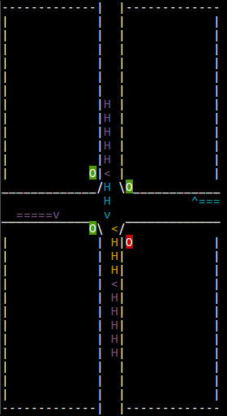

# Vehicle Intersection

Vehicle Intersection (VI) is an [AI Gym](https://gym.openai.com/) compatible reinforcement learning environment.

It is a "Toy Text" environment.  It is highly configurable and difficult.

## Description

Vehicle Intersection simulates a four-way vehicle intersection with stoplights.   Vehicles spawn at the edges of the map and approach the intersection at the center, drivin gon two-land roads.  Each approach to the intersection has a stoplight that can be red or green.  The agent controls these four traffic lights, and action involve turning the lights red or green.

Vehicles move at a fixed speed when unimpeded.  If they are blocked by a vehicle in front of them going in the same direction, they stop.  If they are blocked by a vevicle in front of them going in a different direction, there is a collision.  If a vehicle approaches the edge of the intersection and encounters a green light, it continues moving, if it approaches the edges of an intersection and encounters a red light, it stops and waits until the light is green, at which point it move forward.

Additionally, each vehicle has an attribute called a "turn signal" indicating whether it will turn, go left, or go right at the intersection.

Each episode runs either until a configurable number of vehicles spawn and exit the intersection safely or until a collision occurs.

The agent receives a penalty of -1 when a vehicle is forced to wait at a red light (per vehicle, per timestep). A vehicle stuck behind another vehicle waiting at a red light also incurs this penalty. The agent receives a penalty of -1000 when a collision occurs. An optimal episode has at most a reward of 0 (may not always be possible depending how vehicles spawn). The goal becomes to reduce waiting time for vehicles while also avoiding collisions



## Action Space

There are five "Action Sets" which correspond to action spaces.  You can import them as follows:

```python
from vi_env.VehicleIntersectionActionSets import SetByRoad, SetByLight, ToggleRoad, ToggleLight, SetExplicitly
```

When instantiated, each action set has a `describe()` method that gives a description (see **Example** section).  Actions are passed in to the step function as integers.

See also a description of the action space at [ActionSpaces](ActionSpaces.md).

## Observation Space

The observation space is represented by a `4+4*V` vector, where `V` is maximum the number of vehicles that are allowed to be on the map at a single time.

The first four elements indicate which lights are red or green (0 for red, 1 for green) in the following order: Left, Up, Right, Down.

Each set of the next four elements indicates a vehicle on the map.  The four elements in order are:
1. Approach Road: 0-3 for Left, Upper, Right, Lower
1. Position of Front of Vehicle: for an intersection of size 2 and road length of `R` this can range from `0` to `R+2`.  0 means it is about to exit the intersection, 2 would mean it is about to enter the intersection, and a higher number is some distance farther away from the intersection.
1. Length of vehicle: the remaining length of a the vehicle.  Note that when a vehicle partially exits the intersection, it will be represented as a smaller vehicle about to exit.
1. Turn Signal: -1 for left, 0 for straight, and 1 for right


## Requirements

VI requires python 3 and the following python libraries, all available on pip:
* gym 0.10.5+
* six 1.11.0+
* numpy 1.15.4+
* bitarray 0.8.3+

## Setup

In the **vi_env** folder find the three files with the code for Vehicle Intersection.  You can take the **vi_env** folder and drop it into your project and import it as shown in the **Usage** or **Example** section, or just copy in those three files.  Please maintain attribution information.

## Usage

See an example usage below:
```python
from vi_env.VehicleIntersection import VehicleIntersection

env = VehicleIntersection()
env.reset()
action = env.action_space.sample()
env.step(action)
env.render()
```

If you like, you can also specify certain settings in the environment.

Some useful ones may be the action set, the maximum vehicles on the map, and the road length.
```python
from vi_env.VehicleIntersection import VehicleIntersection
from vi_env.VehicleIntersectionActionSets import SetByLight

env = VehicleIntersection(action_set=SetByLight(),
                          max_vehicles_on_map=4,
                          road_length=20)
env.reset()
action = env.action_space.sample()
env.step(action)
env.render()
```

A Vehicle Intersection environment has the standard methods of `reset()` and `step(action)`, as well as a `render()` method which can be run in a terminal to output a visual representation of the state.

## Example

Included in this repository is the `disp_env.py` script, which runs the environment with random actions.  Run it with `python3 disp_env.py` in the terminal to see a representation of the environment over a sequence of timesteps with random actions.

## Settings

`VehicleIntersection()` can be instantiated with a number of parameters.  They are explained here.

* **action_set**: which of the action sets to use (ToggleRoad(), ToggleLight(), SetByRoad(), SetByLight(), SetExplicitly()), default: ToggleRoad()
* **road_length**: length of the road before the intersection. (intersection length is 2.) default: 14
* **use_turn_signals**: boolean. if False, cars only go straight.
default: True
* **turn_signal_dist**: 3-tuple. If using turn signals, probabilties
of each occurring in a given vehicle. (Left, None \[Straight\],
Right) default: `(0.33, 0.34, 0.33)`
* **max_vehicles_on_map**: when this number of vehicles are
on the map, do not spawn additional vehicles until at least one exits the intersection. **_Note: This parameter affects the size of the observation space._** default: 8
* **vehicle_types**: an OrderedDict of (string → 2-Tuple(int, int)
) pairs. This corresponds to (“vehicle name” -> (“length min”, “length max”)). default: `OrderedDict([("car", (4, 4)),
("van", (6, 6)), ("truck", (8, 12))])`
* **vehicle_dist**: Tuple of length equal to size of vehicle_types. Probability of each vehicle type spawning each time a vehicle is to spawn. default: `(0.4, 0.35, 0.25)`
* **vehicle_colors**: OrderedDict of (string → string) pairs in-
dicating what color each vehicle type should be in the rendering. default: `OrderedDict([("car", "yellow"), ("van", "magenta"), ("truck", "cyan")])`
* **vehicle_speed**: the distance an unimpeded vehicle will move each timestep. default: 1
* **spawn_interval**: 2-Tuple indicating minimum and maximum
time to wait between spawning vehicles. default: `(2, 7)`
* **vehicles_to_spawn_per_episode**: the number of vehicles to
spawn per episode. affects episode length. default: 10
* **lights_init**: starting configuration of the lights. The default
is all green. default: `(1, 1, 1, 1)`
* **waiting_penalty**: default: -1
* **collision_penalty**: default: -1000

## Credit

This projct was written by Aaron M. Roth.

If you use it in an academic project or other context in which it would be appropriate to cite, please cite my Master's Thesis "Structured Representations for the Behavior of Autonomous Robots," bibtex as follows:

    @mastersthesis{Roth-2019-117131,
    author = {Aaron Roth},
    title = {Structured Representations for Behaviors of Autonomous Robots},
    year = {2019},
    month = {July},
    school = {Carnegie Mellon University},
    address = {Pittsburgh, PA},
    number = {CMU-RI-TR-19-50},
    keywords = {Artificial Intelligence, Explainable Artificial Intelligence, Human Robot Interaction, Reinforcement Learning, Decision Trees, Robotics Frameworks, Instruction Graph, Learning by Instruction},
    }

